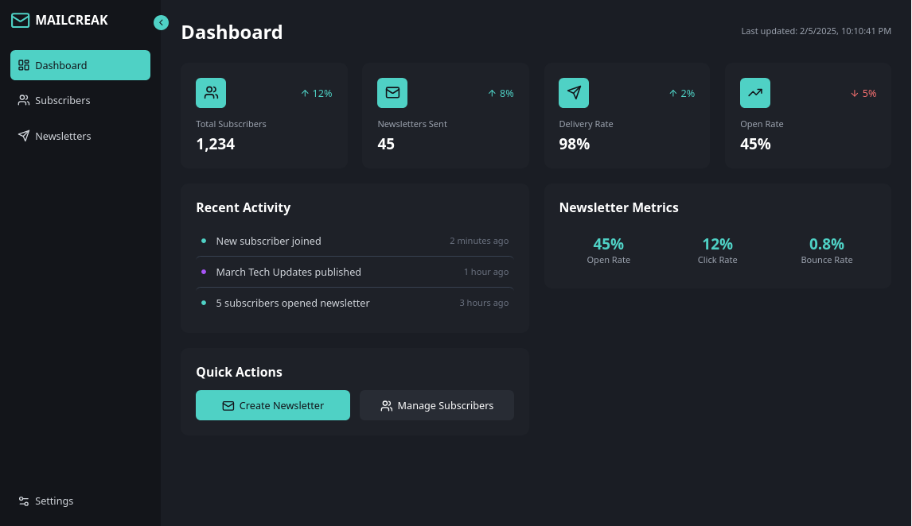
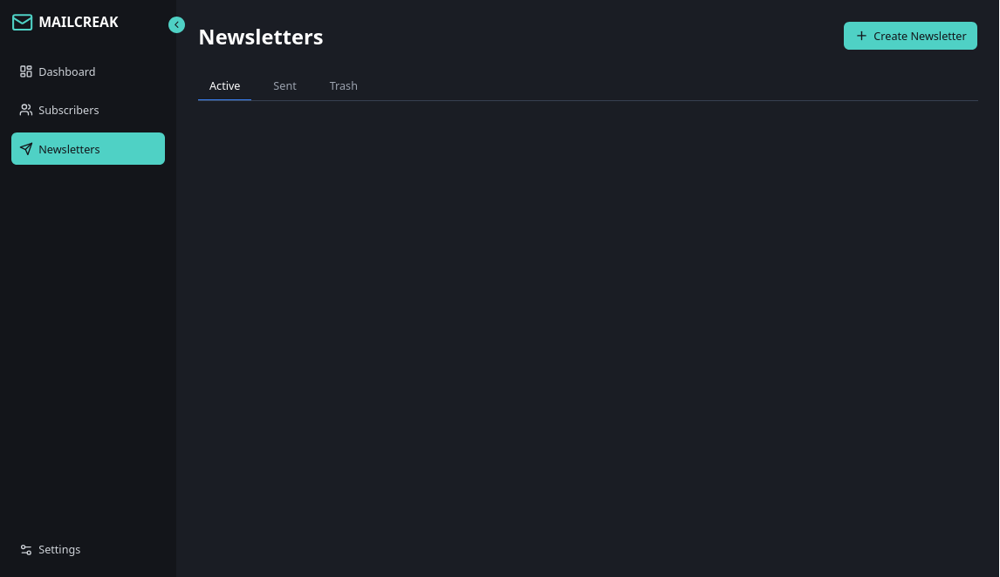
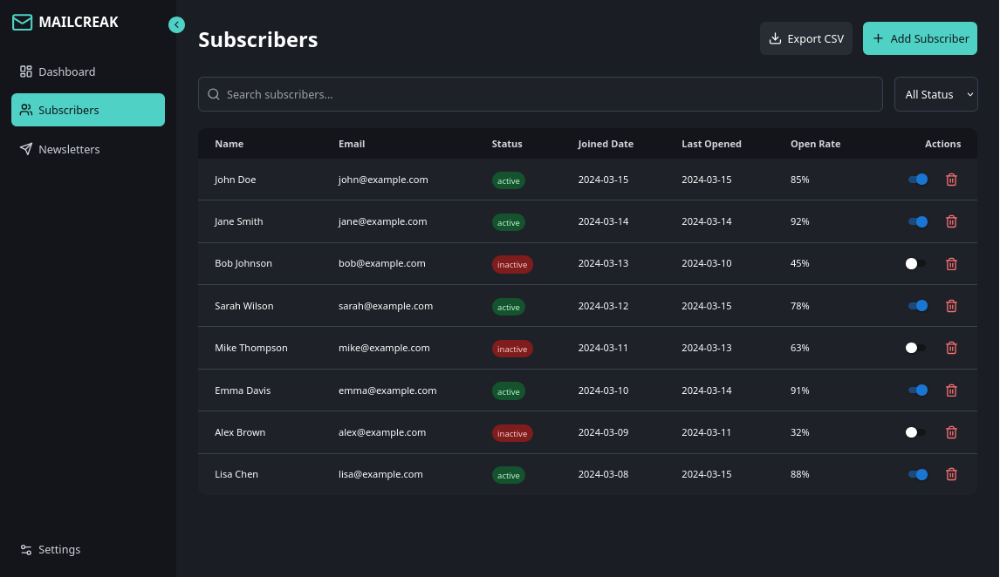

# MailCreak - Newsletter Management Application

MailCreak is a modern web application designed to streamline newsletter creation, subscriber management, and campaign performance tracking. Built with React, Tailwind CSS, and other modern web technologies, MailCreak offers a user-friendly interface and a suite of features to help you connect with your audience effectively.

## Preview








## Features

*   **Dashboard:** Provides an overview of key metrics such as total subscribers, newsletters sent, delivery rate, and open rate.
*   **Subscriber Management:**
	*   Add, edit, and delete subscribers.
	*   Import/export subscriber lists in CSV format.
	*   Filter subscribers based on their status (active/inactive).
*   **Newsletter Management:**
	*   Create, edit, and schedule newsletters.
	*   Use a rich text editor (React Quill) to compose engaging content.
	*   Send newsletters to subscribers and track their performance.
	*   Archive and manage past newsletters.
*   **Settings:**
	*   Customize the application's appearance with a dark/light mode toggle.
	*   Manage account security settings.
	*   Access legal information such as terms of use and privacy policy.
*   **Responsive Design:** The application is fully responsive and works seamlessly on desktops, tablets, and mobile devices.
*   **Modern UI:** Built with Tailwind CSS for a sleek and modern user interface.

## Technologies Used

*   React: A JavaScript library for building user interfaces.
*   React Router DOM: For navigation and routing within the application.
*   Tailwind CSS: A utility-first CSS framework for styling the application.
*   Lucide React: A library of beautiful, consistent icons.
*   React Hot Toast: For displaying toast notifications.
*   React Quill: A rich text editor component.
*   React Datepicker: A datepicker component for scheduling newsletters.
*   MUI Switch: A switch component from Material UI for toggling subscriber status.
*   Vite: A fast build tool for modern web development.
*   ESLint: For linting JavaScript and TypeScript code.

## Working Principle

MailCreak is structured as a single-page application (SPA) built with React. The application's state is managed using React's `useState` hook. The application's components are designed to be modular and reusable.

1.  **Routing:** React Router DOM is used to handle navigation between different sections of the application, such as the dashboard, subscriber list, newsletter editor, and settings.
2.  **Styling:** Tailwind CSS is used to style the application's components. Custom CSS is used for scrollbar styling, dark mode transitions, animations, status badges, and React Quill editor.
3.  **Data Management:** The application uses local state to manage data. In a production environment, this data would be stored in a database and fetched using an API.
4.  **Dark Mode:** The application supports a dark mode, which can be toggled in the settings. The dark mode is implemented using Tailwind CSS's dark mode variant and CSS variables.
5.  **Components:**
	*   `App`: The main component that renders the sidebar and the main content area.
	*   `Sidebar`: The sidebar component that provides navigation links.
	*   `Dashboard`: The dashboard component that displays key metrics.
	*   `Subscribers`: The subscriber management component.
	*   `Newsletters`: The newsletter management component.
	*   `NewsletterEditor`: The newsletter editor component.
	*   `Settings`: The settings component.

## Installation

1.  Clone the repository:

	```bash
	git clone <repository_url>
	```

2.  Navigate to the project directory:

	```bash
	cd mailcreak
	```

3.  Install the dependencies:

	```bash
	npm install
	```

## Usage

1.  Start the development server:

	```bash
	npm run dev
	```

2.  Open your browser and navigate to `http://localhost:<port>` (usually `http://localhost:5173`).

## Contributing

Contributions are welcome! Please feel free to submit a pull request.

## License

MIT